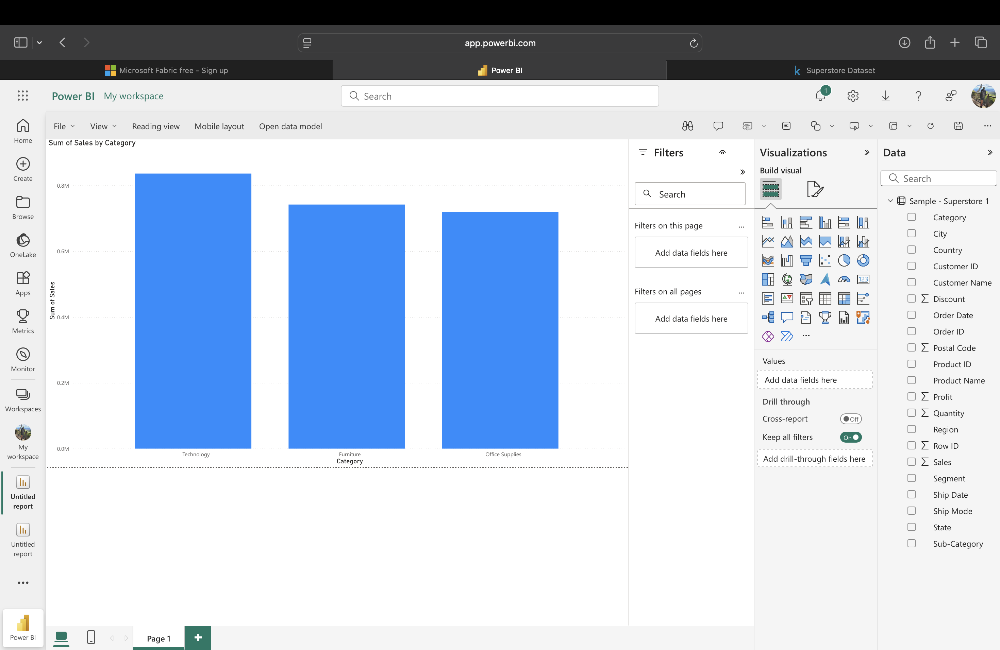

# Retail Sales Dashboard 📊

This project is an interactive Power BI dashboard built using Superstore sales data. It visualizes key performance metrics across categories, regions, and time.

## 💼 Key Features
- KPI cards for Total Sales, Profit, and Quantity
- Interactive slicers to filter Category data
- Sales by Category bar chart
- Monthly Sales Trend line chart
- Clean layout with business-ready design

## 🛠 Tools Used
- Power BI (Web)
- CSV dataset (Superstore)
- DAX (basic measures)

## 📸 Screenshots

### Dashboard Overview

### KPI Cards

> Total Sales, Profit, and Quantity cards displayed at the top for quick insight into performance metrics.

### Sales By Category

> Clustered bar chart comparing sales across product categories, helping to identify top-performing segments like Technology and Furniture.

### Monthly Sales Trend

> Line chart showing sales performance over time, helping to identify seasonal trends and growth patterns.

### Category Filter

> Interactive slicer enabling users to filter all visuals by product category (e.g., Technology, Furniture).

## 🧠 Insights
- Technology category had the highest revenue
- Sales peaked in Q4 across all years
- West region showed the most consistent growth
